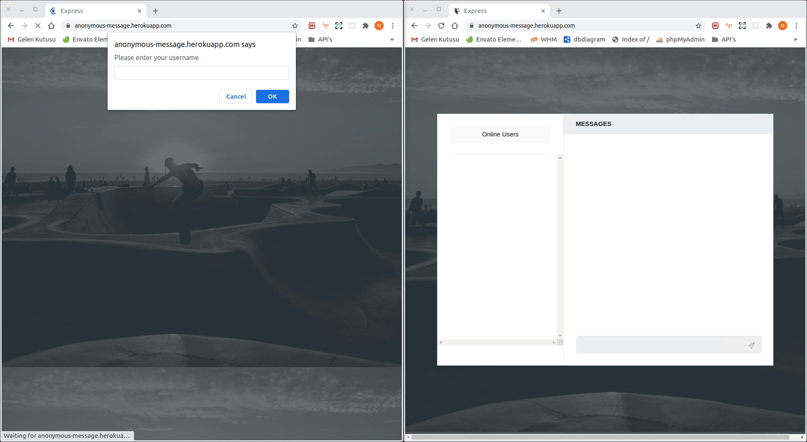

[](https://api.travis-ci.org/nejdetkadir/secret-message)
[](https://www.codacy.com/gh/nejdetkadir/secret-message/dashboard?utm_source=github.com&amp;utm_medium=referral&amp;utm_content=nejdetkadir/secret-message&amp;utm_campaign=Badge_Grade)

# secret-message
Anonymous and secret chat application. From now on You can chat with other people anonymously.



# Project setup
### Prerequirites
- NodeJS (>=10.x)
- npm

### Installation
Clone repo and install dependencies
``` bash 
$ git clone https://github.com/nejdetkadir/secret-message.git
```
``` bash 
$ cd secret-message
```
``` bash 
$ npm install && bower install
```
If you want to use any server, you must change url from /public/javascripts/controller/indexController.js:15
```javascript
const url = 'https://anonymous-message.herokuapp.com';
``` 
### Run the app
``` bash 
$ npm start
```

# Demo
[Live demo on Heroku](https://anonymous-message.herokuapp.com)

# License
This application is licensed under the  MIT License.
